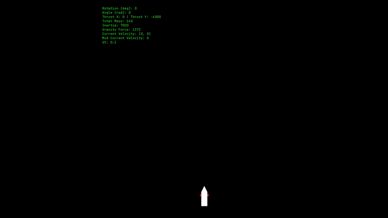

# Rocket Landing Simulation

Este projeto é uma simulação 2D de pouso de foguete desenvolvida em C++ utilizando a biblioteca **SFML**. O objetivo principal é simular a física envolvida no controle de um foguete, incluindo empuxo, gravidade, torque e consumo de combustível.

## 🚀 O Projeto

A simulação modela um foguete com um propulsor principal na base e dois propulsores laterais para controle de atitude. O desafio consiste em gerenciar a aceleração e a rotação para realizar um pouso suave, evitando que o foguete exploda ao atingir o solo com velocidade excessiva.

## ⚖️ Física e Dinâmica

### Centro de Massa e Inércia
O centro de massa do foguete não é estático. Ele é calculado dinamicamente com base na massa dos componentes fixos e na massa variável do combustível:
- **Massa Total:** Soma da massa dos componentes e da massa atual do combustível.
- **Centro de Massa (y):** Calculado pela média ponderada das posições do tanque de combustível e dos componentes.
- **Momento de Inércia:** Calculado com base na distribuição de massa em relação ao centro de massa atual, influenciando diretamente a facilidade com que o foguete rotaciona.

### Eixo de Rotação e Torque
A rotação do foguete é controlada por propulsores laterais localizados em uma posição fixa no corpo do foguete. 
- Quando um propulsor lateral é ativado, ele aplica uma força perpendicular ao corpo do foguete.
- O **Torque ($	au$)** gerado é o produto da força do propulsor pela distância até o centro de massa atual ($r$): $	au = F 	imes r$.
- Isso resulta em uma aceleração angular ($\alpha$), de acordo com $\alpha = 	au / I$, onde $I$ é o momento de inércia.

### Forças e Integração
- **Gravidade:** Aplicada continuamente para baixo.
- **Empuxo (Thrust):** O propulsor principal aplica uma força na direção oposta ao topo do foguete.
- **Movimento:** A velocidade e a posição são atualizadas a cada frame utilizando integração de Euler simples.

## 🕹️ Controles
- `Espaço`: Ativa o propulsor principal.
- `A`: Ativa o propulsor lateral esquerdo (rotaciona para a direita).
- `D`: Ativa o propulsor lateral direito (rotaciona para a esquerda).

## 🧠 Futuro: Inteligência Artificial
O próximo passo deste projeto é a implementação de uma **Rede Neural** (provavelmente utilizando Aprendizado por Reforço) para aprender a pilotar o foguete autonomamente. O agente receberá dados como posição, velocidade, ângulo e combustível restante para aprender a executar o pouso perfeito sem explodir o foguete.

## 🛠️ Requisitos
- Compilador C++ (suporte a C++17 ou superior).
- SFML 2.5+.
- CMake.
