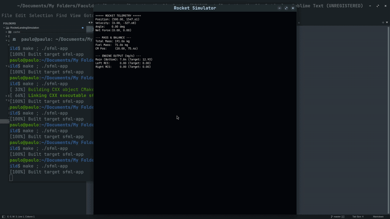

# 🚀 Rocket Physics Simulator (WIP)

Um simulador de foguetes 2D desenvolvido em C++ focado em **física termodinâmica real** e dinâmica de corpos rígidos. Este projeto utiliza equações de mecânica dos fluidos para calcular o empuxo baseado na geometria do bocal (nozzle) e propriedades do combustível.

> ⚠️ **Status:** Este projeto ainda não foi finalizado. Atualmente, o foco está na estabilização do solver numérico e no refinamento da telemetria.

## 🛠️ Tecnologias Utilizadas

* **Linguagem:** C++ (Padrão Moderno).
* **Gráficos/Interface:** SFML (Simple and Fast Multimedia Library) para renderização 2D e gerenciamento de janelas.
* **Matemática:** Solver numérico de Newton-Raphson para resolução de equações transcendentes.

## 🧪 Física Aplicada

Diferente de simuladores arcade, este projeto calcula a força de propulsão através de parâmetros reais:

### 1. Termodinâmica de Bocais (Nozzles)
O simulador resolve a relação de área-Mach para fluxos isentrópicos:
$$\frac{A_e}{A_t} = \frac{1}{M} \left[ \frac{2}{\gamma + 1} \left( 1 + \frac{\gamma - 1}{2} M^2 \right) \right]^{\frac{\gamma + 1}{2(\gamma - 1)}}$$

A partir do número de Mach calculado via **Newton-Raphson**, determinamos:
* **Velocidade de Exaustão ($V_e$):** Baseada na temperatura da câmara e constante do gás.
* **Pressão de Saída ($P_e$):** Crucial para o cálculo do empuxo em diferentes altitudes.

### 2. Dinâmica de Corpo Rígido
* **Centro de Massa (CM):** Calculado dinamicamente com base nos componentes adicionados ao foguete.
* **Momento de Inércia ($I$):** Atualizado conforme o combustível é consumido, afetando a velocidade angular.
* **Arrasto (Drag):** Calculado com base na densidade do ar, área frontal e velocidade.

## 🏗️ Decisões de Arquitetura

* **Modularidade de Boosters:** Cada propulsor (`RocketBooster`) é uma entidade independente que gerencia suas próprias propriedades termodinâmicas (vazão, áreas, temperatura).
* **PPM (Pixels Per Meter):** Implementamos um fator de conversão para garantir que as forças em Newtons sejam traduzidas corretamente para o sistema de coordenadas de tela do SFML.
* **Solver Numérico Encapsulado:** Uma estrutura dedicada para o método de Newton-Raphson que permite trocar a precisão e a função a ser resolvida sem alterar a lógica do motor.

## 🎮 Controles Atuais

* `Space`: Ativa propulsor principal (Bottom).
* `A` / `D`: Ativa propulsores laterais (RCS).
* `Up` / `Down`: Controla a vazão de combustível ($\dot{m}$) do motor principal.
* `K` / `J` e `P` / `O`: Controle de saída dos propulsores laterais.

## 📈 Próximos Passos
* [ ] Interface gráfica (HUD) mais detalhada para telemetria em tempo real.
* [ ] Sistema de controle automático via Rede Neural.
